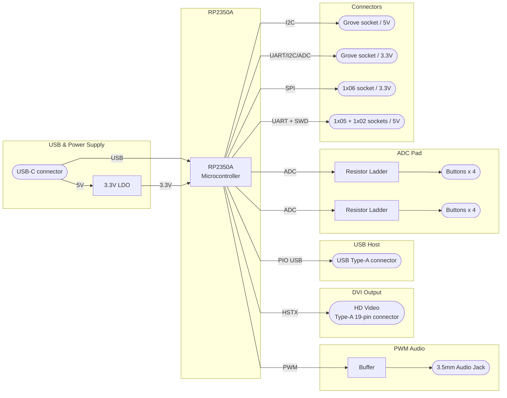

# Harucom-board

Harucom is about a $20 handmade single-board computer that demonstrates how a standalone Ruby computer can be built with mruby. It provides a complete programming environment with display output and keyboard input, all without a host PC.

Built around the RP2350A microcontroller, the board features DVI video output, USB host for keyboard input, stereo PWM audio, and Grove/SPI expansion connectors.

The name "Harucom" does not have one strictly defined meaning. For example, it stands for:

  - **H**euristically **A**ccessible **Ru**by **Com**puter
  - **Ha**kodate **Ru**byKaigi **Com**ponent
  - **Haru**kasan's Ruby **Com**puter

Harucom aims to be an accessible computer where people can learn Ruby programming intuitively. By reducing the complexities of modern computing, I hope it allows users to dive into the essence of programming.

## Features

- **MCU:** Raspberry Pi RP2350A
- **Memory:** 16 MB QSPI Flash + 8 MB QSPI PSRAM
- **Video:** DVI output via Type-A connector
- **Audio:** Stereo PWM audio via 3.5mm jack
- **USB-C:** Power supply & Data
- **USB-A:** Host port
- **Input:** 8 tactile buttons
- **Expansion:** 2x Grove (I2C/UART/ADC/GPIO), SPI, SWD

## Block Diagram



## Directory Structure

```
harucom-board/
├── *.kicad_sch          # Schematic files
├── harucom-board.kicad_pcb  # PCB layout
├── harucom-board.kicad_pro  # KiCad project file
├── docs/                # Documentation
│   └── harucom-board-schematic.pdf
├── lib/                 # Custom symbol and footprint libraries
│   ├── Harucom_Board.kicad_sym
│   ├── Harucom_Board.pretty/
│   └── ...
└── jlcpcb/              # JLCPCB fabrication output
    └── production_files/
```

## Documentation

- [Schematic (PDF)](docs/harucom-board-schematic.pdf)

## Tools

- [KiCad](https://www.kicad.org/) 9.0

## License

© 2026 Shunsuke Michii

This project is licensed under the [CERN Open Hardware Licence Version 2 - Permissive (CERN-OHL-P v2)](LICENSE.md).
